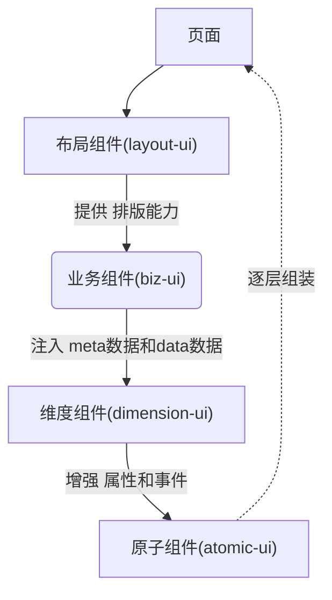

---
# 这是文章的标题
title: 优速搭平台简介
# 这是页面的图标
icon: page
# 这是侧边栏的顺序
order: 1
# 设置作者
author: gd
# 设置写作时间
date: 2022-09-07
# 一个页面可以有多个分类
category:
  - 使用指南
# 一个页面可以有多个标签
tag:
  - 开始低代码之旅
# 此页面会在文章列表置顶
sticky: true
# 此页面会出现在文章收藏中
star: true
# 你可以自定义页脚
footer: 这是测试显示的页脚
# 你可以自定义版权信息
copyright: 无版权
---

## 什么是优速搭？

优速搭是一款用于搭建web、app、小程序等应用的低代码平台。而且支持二次开发，允许二次开发后反向可视化继续配置。在不失灵活性的前提下，大大提高您开发应用的效率。 
优速搭包含了 应用设计器、应用市场、模块市场、前端组件库、前端项目框架(uniapp)、后端项目框架(ruoyi-pro)、后端核心包、业务流程引擎、审批流程引擎等。 
优速搭低代码平台由多个功能部分组成，且平台是面向零代码、低代码、高代码所有用户开放的，因此不同用户需要了解的功能有所侧重，以下是不同使用者对应需要侧重了解的功能。

|        功能部分         |                                         描述                                         |   使用群体    |
| :---------------------: | :----------------------------------------------------------------------------------: | :-----------: |
|       应用设计器        |                    可视化的管理数据、配置页面呈现。(支持源码导出)                    | 零代码NoCode  |
|        应用市场         | 由其它用户使用优速搭平台开发的完整应用，能直接复用整个应用，且可在设计器中自己订制。 | 零代码NoCode  |
|        模块市场         |    由其它用户使用优速搭平台开发的模块，能直接复用，且可在设计器中引用集成该模块。    | 零代码NoCode  |
|  前端项目框架(uniapp)   |      允许用户按一定规范修改前端页面代码，并且不会在与零代码混合开发时发生冲突。      | 低代码LowCode |
| 后端项目框架(ruoyi-pro) |      允许用户按一定规范修改后端逻辑代码，并且不会在与零代码混合开发时发生冲突。      | 低代码LowCode |
|       前端组件库        |                         允许用户以NPM包的方式使用前端组件。                          | 高代码ProCode |
|       后端核心包        |                    允许用户以Maven包的方式使用后端增删改查逻辑。                     | 高代码ProCode |

## 应用设计器简介

通常开发一款应用涉及两部分 前端开发 和 后端开发。前端开发用于搭建页面呈现效果，页面交互逻辑，并把后端提供的数据渲染出来。后端开发用于处理业务上的数据维护(增删改查)、业务流程的调度等。  
因此优速搭应用设计器也分为以下两部分：

### 数据维护
1. 物理表的基础维护 

2. 字典的基础维护 

3. 关联关系的维护(表关联、字典关联) 

### 页面配置

## 优速搭低代码实现原理
首次进入应用会调用一次资源接口(`getResourceList`)存放在本地，以获取应用需要哪些页面，以及每个页面的配置信息(如页面的`布局信息`、由哪些`biz组件`组成)。每当跳转到一个页面的时候，会根据页面的配置信息渲染出对应的界面。每个页面由多个`biz组件`构成，`biz组件`也称为`biz容器`，内部可以容纳维度组件包裹的原子组件。在应用设计器中修改`biz容器属性`、`原子组件的属性`实现定制化页面的效果。

## 概念设计
1. 简介: **优速搭**为了解决灵活性可配置性的同时降低用户的二开成本。**首创提出**四种组件：**布局组件(layout-ui)**、**业务组件(biz-ui)**、**维度组件(dimension-ui)**、**原子组件(atomic-ui)**。通常情况下用户有个性话需求只需要上传原子组件即可,当然在线设计完成后可下载源码完全离线继续二次开发。
2. 设计思路: 组件的按此分类设计是经过大量实践沉淀总结出来的。每一层组件都分别对应解决不同的问题，并非凭空创造的概念。首先用户的需求不管怎么变最终都总结为 **UI交互** + **数据的CURD**。优速搭将每个组件都对应成**schema**,**schema**即**UI**。所以最核心的是**业务组件(biz-ui)**,业务组件没有额外功能仅提供注入能力,注入**meta数据**控制UI、注入**data数据**控制内容的变化。**业务组件**处理完后就将注入的**meta数据**和**data数据**交给**维度组件**,维度组件中的`dimension-item-content`组件能够把包裹其中的**原子组件**内的属性、事件进行增强，使得组件之间联动交互更方便。

### 四种组件对比

<table>
<tr style=""><td colspan="10" style="min-width:100%;display:flex;flex-direction: row;justify-content:space-between;">
顶层

---->

底层
</td></tr>
    <tr>
        <th style="min-width:80px;">组件分类</th>
        <td>布局组件(layout-ui)</td>
        <td>业务组件(biz-ui)</td>  
        <td>维度组件(dimension-ui)</td> 
        <td>原子组件(atomic-ui)</td> 
    </tr>
    <tr>
        <th style="min-width:80px;">简介</th>
        <td style="min-width:220px;">布局组件，是一个页面的最外层组件,用于<strong>控制内层组件的布局样式</strong>，内部可以承载多个业务组件或原子组件。目前支持栅格布局、固定布局+flex布局</td>
        <td style="min-width:220px;">业务组件(biz-ui)，是向<strong>下一层组件</strong>注入 "增删改查能力" + "UI元数据(meta数据)"的组件。</td>
        <td style="min-width:220px;">维度组件，维度组件不是凭空创造的概念，是为了解决低代码平台组件间联动交互等问题。维度组件<strong>包裹</strong>了原子组件，<strong>增强了 内部原子组件的属性和事件</strong>。维度组件分为 一维型:对象型容器(表单)、二维型:数组型容器(表格、循环的卡片等)。表单中的每一项原子组件 与 其它原子组件的联动;表格中每行每列与其它行列的联动。都可以通过在事件回调中修改对应的meta数据来实现。</td>
        <td style="min-width:220px;">原子组件，最基础的组件。用户可以任意写逻辑。如果原子组件编写了<strong>配置文件</strong>，则说明允许暴露给维度组件包裹，则可以通过内部的事件参数来读写其它的meta数据。</td>
    </tr>
    
</table>

## 关于作者
本人是于2019年 - 2020年 期间使用`renren-fast`、`ruoyi`等后端框架做过大量项目，其中在开发过程中使用代码生成器`codegen`后，启发了开始低代码方面的探索之路。且在2021年加入头部工业互联网企业，期间会接触很多其它的各类垂直领域的制造业低代码平台，在使用后觉得目前市面上的低代码平台仍有很多改进空间。因此开始了优速搭低代码平台的自研之路。 
目前优速搭平台部分组件已在内部项目中广泛使用，体验良好，大大提高了开发效率。因此希望开源开放出来，供更多的企业使用，助力企业数字化转型。

