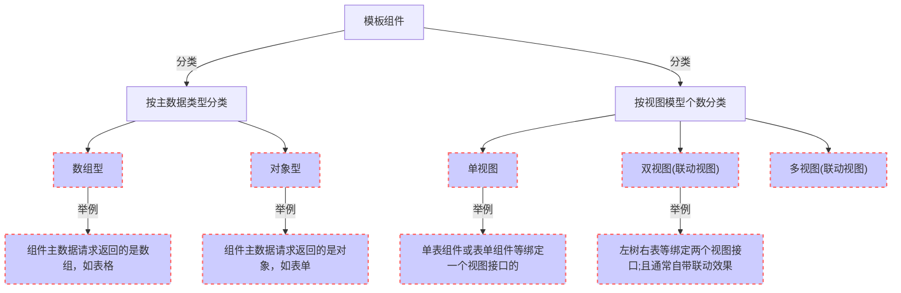

---
# 这是文章的标题
title: 模板组件层介绍
# 这是页面的图标
icon: page
# 这是侧边栏的顺序
order: 1
# 设置作者
author: gd
# 设置写作时间
date: 2022-09-07
# 一个页面可以有多个分类
category:
  - 优速搭二次开发
# 一个页面可以有多个标签
tag:
  - 简介
  - 前端
  - 优速搭二次开发
# 此页面会在文章列表置顶
sticky: true
# 此页面会出现在文章收藏中
star: true
# 你可以自定义页脚
footer: 这是测试显示的页脚
# 你可以自定义版权信息
copyright: 优速搭 版权所有
---

## 模板组件概念
* 模板组件是一种把具体场景交互固化下来的**容器**，内部可以容纳**原子组件**。
* 界面中某个业务的交互不管多复杂必定包含以下三部分：**主数据**、**搜索表单数据**、**按钮等事件流触发的表单数据**。
* 其中**主数据**有可以分成两类：**数组型**的(如表格)、**对象型**的(如表单)
* 其中上面的三个部分组合就形成一个 **"视图模型"**,就相当于一组增删改查的接口

::: tip
注意：上面说的左树右表并不仅仅指前端意义的界面左树右表，是一种**泛化联动的概念**。 对后端来说可以理解为A表 <--关联--> B表;其中左树的那张表是 关联表中 1对多的那个1 或少对多的那个少 所在的表。 因为往往这样的两张关联表在前端意义上是需要联动的。 取名为左树右表是更加形象便于没有开发经验的朋友理解。
:::
