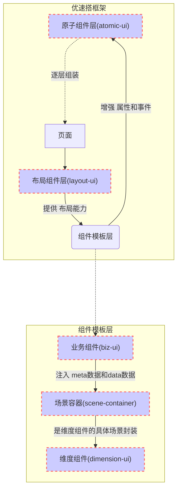

---
# 这是文章的标题
title: 优速搭平台软件架构
# 这是页面的图标
icon: home
# 这是侧边栏的顺序
order: 2
toc: false
# 设置作者
author: gd
# 设置写作时间
date: 2022-09-07
# 一个页面可以有多个分类
category:
  - 使用指南
# 一个页面可以有多个标签
tag:
  - 开始低代码之旅
# 此页面会在文章列表置顶
sticky: true
# 此页面会出现在文章收藏中
star: true
# 你可以自定义页脚
footer: 这是测试显示的页脚
# 你可以自定义版权信息
copyright: 优速搭出品
---

## 什么是优速搭？

**优速搭**是一款用于搭建 web、app、小程序等应用的低代码平台。而且支持二次开发，允许二次开发后反向可视化继续配置。在不失灵活性的前提下，大大提高您开发应用的效率。 
优速搭包含了 应用设计器、应用市场、模块市场、前端组件库、前端项目框架(uniapp)、后端项目框架(ruoyi-pro)、后端核心包、业务流程引擎、审批流程引擎等。 
优速搭低代码平台由多个功能部分组成，且平台是面向零代码、低代码、高代码所有用户开放的，因此不同用户需要了解的功能有所侧重，以下是不同使用者对应需要侧重了解的功能。

<table>
    <tr>
        <th style="min-width:80px;">分类</th>
        <th style="min-width:130px;">功能部分</th>
        <th>描述</th>
        <th>使用群体</th>
        <th>开发进展与计划</th>
    </tr>
    <tr>
        <th style="min-width:120px;" >优速搭效率工具</th>
        <td class="gd-acc--function">应用设计器</td>
        <td class="gd-acc--desc">可视化的管理数据、配置页面呈现。(支持源码导出)</td>
        <td class="gd-acc--design-for">零代码 NoCode</td>
        <td class="gd-acc--plan">持续完善中并且可以使用</td>
    </tr>
    <tr>
        <th style="min-width:130px;">IDEA插件</th>
        <td class="gd-acc--function"><a href="https://ext.dcloud.net.cn/plugin?id=11368" target="_blank">gd-accbuild-idea-extension</a></td>
        <td class="gd-acc--desc">表结构、UI元数据同步等功能</td>
        <td  class="gd-acc--design-for">低代码 LowCode</td>
        <td class="gd-acc--plan">持续完善中可以使用</td>
    </tr>
    <tr>
        <th style="min-width:120px;" rowspan="4">优速搭核心框架</th>
        <td class="gd-acc--function">
前端项目框架

gd-accbuild-admin

gd-accbuild-mobile

        
<a href="https://gitee.com/gd771747384/gd-accbuild-demo-base" target="_blank">gd-accbuild-demo-base</a>
(纯净版;最简单方式体验)

</td>
        <td class="gd-acc--desc">允许用户按一定规范修改前端页面代码，并且遵循一定的合并策略，不会在与零代码混合开发时发生冲突。</td>
        <td  class="gd-acc--design-for">低代码 LowCode</td>
        <td class="gd-acc--plan">持续完善中可以使用</td>
    </tr>
    <tr>
        <td class="gd-acc--function">
前端核心框架

<a href="http://designer.gd-accbuild.com" target="_blank">gd-accbuild-core</a>
</td>
        <td class="gd-acc--desc">允许用户以 NPM 包的方式使用前端组件。</td>
        <td  class="gd-acc--design-for">高代码 ProCode</td>
        <td class="gd-acc--plan">持续完善中可以使用</td>
    </tr>
    <tr>
        <td class="gd-acc--function">
后端项目框架

不限制
</td>
        <td class="gd-acc--desc">只需要集成gd-accbuild-server使用即可，默认会根据设计器的配置自动生成CRUD接口。也允许用户根据请求api接口的override实现定制后端逻辑代码，并且不会在与零代码混合开发时发生冲突。</td>
        <td  class="gd-acc--design-for">低代码 LowCode</td>
        <td class="gd-acc--plan">暂未完善,暂不可用。目前使用的是nodejs,计划使用kotlin/js重写,发布成maven包和npm包</td>
    </tr>
    <tr>
        <td class="gd-acc--function">serverless</td>
        <td class="gd-acc--desc">直接使用unCloud部署后端，按量付费价格跟uniCloud标准一致。</td>
        <td  class="gd-acc--design-for">低代码 LowCode</td>
        <td class="gd-acc--plan">持续完善中可以使用</td>
    </tr>
    <tr>
    <th style="min-width:130px;" rowspan="2">优速搭开发者生态</th>
        <td class="gd-acc--function">应用市场</td>
        <td class="gd-acc--desc">由其它用户使用优速搭平台开发的完整应用，能直接复用整个应用，且可在设计器中自己订制。</td>
        <td  class="gd-acc--design-for">零代码 NoCode</td>
        <td class="gd-acc--plan">持续完善中可以使用</td>
    </tr>
    <tr>
        <td class="gd-acc--function">模块市场</td>
        <td class="gd-acc--desc">由其它用户使用优速搭平台开发的模块，能直接复用，且可在设计器中引用集成该模块。</td>
        <td  class="gd-acc--design-for">零代码 NoCode</td>
        <td class="gd-acc--plan">持续完善中可以使用</td>
    </tr>
</table>

## 应用设计器简介

通常开发一款应用涉及两部分 前端开发 和 后端开发。前端开发用于搭建页面呈现效果，页面交互逻辑，并把后端提供的数据渲染出来。后端开发用于处理业务上的数据维护(增删改查)、业务流程的调度等。 
因此优速搭应用设计器也分为以下两部分：

### 数据维护

1. 物理表的基础维护 
   
2. 字典的基础维护 
   
3. 关联关系的维护(表关联、字典关联) 
   

### 页面配置

## 优速搭低代码实现原理

首次进入应用会调用一次资源接口(`getResourceList`)存放在本地，以获取应用需要哪些页面，以及每个页面的配置信息(如页面的`布局信息`、由哪些`biz组件`组成)。每当跳转到一个页面的时候，会根据页面的配置信息渲染出对应的界面。每个页面由多个`biz组件`构成，`biz组件`也称为`biz容器`，内部可以容纳维度组件包裹的原子组件。在应用设计器中修改`scene容器属性`、`原子组件的属性`实现定制化页面的效果。

## 概念设计

1. 简介: **优速搭**为了解决灵活性可配置性的同时降低用户的二开成本。**首创提出**五种组件：**布局组件(layout-ui)**、**业务组件(biz-ui)**、**场景容器(scene-container)**、**维度组件(dimension-ui)**、**原子组件(atomic-ui)**。通常情况下用户有个性话需求只需要上传原子组件即可,当然在线设计完成后可下载源码完全离线继续二次开发。
2. 设计思路: 组件的按此分类设计是经过大量实践沉淀总结出来的。每一层组件都分别对应解决不同的问题，并非凭空创造的概念。首先用户的需求不管怎么变最终都总结为 **UI 交互** + **数据的 CURD**。优速搭将每个组件都对应成**schema**,**schema**即**UI**。所以最核心的是**业务组件(biz-ui)**,业务组件没有额外功能仅提供注入能力,注入**meta 数据**控制 UI、注入**data 数据**控制内容的变化。**业务组件**处理完后就将注入的**meta 数据**和**data 数据**通过**场景容器**交给**维度组件**,维度组件中的`dimension-item-content`组件能够把包裹其中的**原子组件**内的属性、事件进行增强，使得组件之间联动交互更方便。

### 五种组件对比

<table>
<tr style=""><td colspan="10" style="min-width:100%;display:flex;flex-direction: row;justify-content:space-between;">
顶层

---->

底层
</td></tr>
    <tr>
        <th style="min-width:80px;">组件分类</th>
        <td>布局组件层(layout-ui)</td>
        <td colspan="3">
        

        
模板组件层

        

        
业务组件(biz-ui)

        
场景容器(scene-container)

        
维度组件(dimension-ui)

        

        

        </td>  
        <!--   -->
        <!-- <td>维度组件(dimension-ui)</td>  -->
        <td>原子组件层(atomic-ui)</td> 
    </tr>
    <tr>
        <th style="min-width:80px;">简介</th>
        <td style="min-width:220px;">布局组件，是一个页面的最外层组件,用于<strong>控制内层组件的布局样式</strong>，内部可以承载多个业务组件或原子组件。目前支持栅格布局、固定布局+flex布局</td>
        <td style="min-width:220px;">业务组件(biz-ui)，是向<strong>下一层组件</strong>注入 "增删改查能力" + "UI元数据(meta数据)"的组件。</td>
        <td style="min-width:220px;">场景容器(scene-container)，是对<strong>维度组件</strong>的具体实现，按**主数据**类型分为一维容器:表单、二维容器:表格、卡片列表等。</td>
        <td style="min-width:220px;">维度组件，维度组件不是凭空创造的概念，是为了解决低代码平台组件间联动交互等问题。维度组件<strong>包裹</strong>了原子组件，<strong>增强了 内部原子组件的属性和事件</strong>。维度组件分为 一维型:对象型容器(表单)、二维型:数组型容器(表格、循环的卡片等)。表单中的每一项原子组件 与 其它原子组件的联动;表格中每行每列与其它行列的联动。都可以通过在事件回调中修改对应的meta数据来实现。</td>
        <td style="min-width:220px;">原子组件，最基础的组件。用户可以任意写逻辑。如果原子组件编写了<strong>配置文件</strong>，则说明允许暴露给维度组件包裹，则可以通过内部的事件参数来读写其它的meta数据。</td>
    </tr>
    <tr>
    <th style="min-width:80px;">定制</th>
    <td><strong>不需要二次开发</strong>,内置提供flex布局</td>
    <td><strong>不需要二次开发</strong>,该层组件规范了平台的schema协议,由平台自动根据您的<strong>场景容器</strong>生成模板</td>
    <td><strong>可以二次开发</strong>,不同场景使用的组件内部逻辑在这里定义</td>
    <td><strong>不需要二次开发</strong>,由平台自动根据您的<strong>原子组件</strong>生成模板</td>
    <td><strong>可以二次开发</strong>,可以任意写符合vue规范的组件</td>
    </tr>
    <tr>
    <th style="min-width:80px;">对应关系</th>
    <td colspan="5">
    一个布局组件 可以容纳 多个业务组件;
    一个业务组件 对应 一个场景容器;
    一个场景容器 可以容纳 多个原子组件。
    </td>
    </tr>
</table>

::: tip
模板层的概念比较多比较抽象，可以具体看<router-link :to="'/zh/development/fontend/组件开发篇/模板组件层/intro.md'">(点我看模板组件的概念)</router-link>
:::
