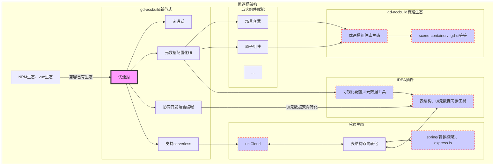

---
# 这是文章的标题
title: 前言
# 这是页面的图标
icon: creative
# 这是侧边栏的顺序
order: 1
# 设置作者
author: gd
# 设置写作时间
date: 2022-09-07
# 一个页面可以有多个分类
category:
  - 使用指南
# 一个页面可以有多个标签
tag:
  - 开始低代码之旅
# 此页面会在文章列表置顶
sticky: true
# 此页面会出现在文章收藏中
star: true
# 你可以自定义页脚
footer: 这是测试显示的页脚
# 你可以自定义版权信息
copyright: 无版权
---

## 低代码为什么一直不温不火？
自2020年前后，随着数字化转型需求的日益增加，低代码零代码的热度变得越来越高。好像如果公司不开发一个低代码平台就不`fashion`🔥了。因此近几年各种开源或商业的低代码相关产品不断涌现，但始终没有出现一款现象及的**合格的**低代码产品。 
> **如何定义低代码的合格性**：我认为零代码低代码平台首先具备高度可扩展性，必须兼容开发者生态，以开源社区为驱动的，最重要的是可以**渐进式使用**，不能平台绑定，项目的运行不强制必须使用该平台全家桶(意味着架构层级分明互不耦合)。否则这样的平台只会是一种盲盒，随着项目复杂度的上升而令使用者(开发者)难以控制，不得不依赖平台来更新维护。
>
先抛开低代码，来谈谈一款优秀的开源框架都具备哪些特点? 
以两个前端的当红炸子鸡 **Vue** 与 **React** 为例:

```mermaid
flowchart TD
    subgraph React架构
        react_org["NPM生态"] <-->|兼容已有生态| react["React"]
        style react fill:#f9f,stroke:#333,stroke-width:4px
        react -->|新范式| react_feature["All In JS、函数式编程"]
        subgraph React框架赋能
            react_feature --> react_jsx["HTML IN JS(JSX)"]
            react_feature --> react_css["CSS IN JS"]
        end
        subgraph React自建生态
            react_jsx --> react_生态["React组件库生态"]
            react_css --> react_生态["React组件库生态"]
            react_生态 --> react_子生态["AntD、taro等等"]
        end
    end

    subgraph Vue架构
        vue_org["NPM生态"] <-->|兼容已有生态| vue["Vue"]
        style vue fill:#f9f,stroke:#333,stroke-width:4px
        vue -->|新范式| vue_feature["渐进式"]
        subgraph Vue框架赋能
            vue_feature --> vue_spc["SPC(单文件组件)"]
            vue_feature --> vue_双向绑定["MVVM(双向绑定)"]
        end
        subgraph Vue自建生态
            vue_spc --> vue_生态["Vue组件库生态"]
            vue_双向绑定 --> vue_生态["Vue组件库生态"]
            vue_生态 --> vue_子生态["element-plus、uniapp等等"]
        end
    end
style react_生态 fill: #ccf, stroke: #f66, stroke-width: 2px, stroke-dasharray: 5,5;
style react_子生态 fill: #ccf, stroke: #f66, stroke-width: 2px, stroke-dasharray: 5,5;
style vue_生态 fill: #ccf, stroke: #f66, stroke-width: 2px, stroke-dasharray: 5,5;
style vue_子生态 fill: #ccf, stroke: #f66, stroke-width: 2px, stroke-dasharray: 5,5;
```

可以看到一款优秀的开源框架必须向上兼容已有生态 的同时 向下引领一种新的编程范式进而衍生出自己的生态。 
## 一款合格的低代码
来看看**优速搭**的架构，其中五大组件的具体概念[点我看概念设计理念](/zh/guide/intro.html#概念设计)

## 产品未来 与 技术众筹
一个优秀的开源产品一定是社区驱动，你一行我一行的pr共同汇聚而成的集体智慧。虽然目前低代码产品已经不少，但大多都是浮于用现成的开源产物的堆砌，几乎没怎么看到有从更高维度规划架构的。虽然我知道目前优速搭低代码平台尚在襁褓期，还有许多需要改进的地方。不过平台的基础架构我已经修整打磨近一年，基础架构已基本建立。而且平台部分组件已在内部项目中广泛使用，体验良好，大大提高了开发效率。但一人之力始终有限，因此诚邀网络上各路大牛各位开发者，如有愿意一起完成认领任务的 或 主动推广宣传的，您将享有以下福利政策。
::: tip
1. 凡是star了项目的可以限时免费使用设计器
2. 凡是贡献了代码的 属于 有效的新功能 或 修复bug的，可以免费使用设计器 以您个人名义或您所在公司使用，贡献高者可以共享优速搭低代码平台收益。
3. 凡是转发点赞评论了博主的优速搭相关技术文章的可以限时免费使用设计器
:::

## 关于作者
本人于17年电气工程及其自动化专业毕业，第一年从事过嵌入式、医学图像处理等工作岗位，但经历下来觉得都不是自己喜爱。后来受学生时代题库智能组卷等网站的启发，觉得自己也能搞一个，就于18年开始在家人支持下(家里经营着药房，应父母要求一边待业在家考执业药师证)自学web开发(前端、后端)。web开发是比较直观的可以见到输出，这更激起我对web开发的热爱。因此因为热爱所以坚持，同时期间看了大几十本编程架构等书籍、每天碎片时间刷刷"掘金app"、"开源中国app"。很快边学边做，第一个产品出来了。而且还不错受到了一家两轮融资的教育直播公司的合伙邀请。不过可惜最终因题库版权风险承担问题，还是遗憾放弃了。随后的 2019 年 - 2020 年 期间本人加入了一家远程办公的企业。并使用`renren-fast`、`ruoyi`等后端框架做过大量项目，其中在开发过程中使用代码生成器`codegen`后，启发了开始低代码方面的探索之路。但由于远程与在大厂工作相比提高历练毕竟有限，于是在 2021 年入职某头部工业互联网企业，期间接触很多其它的各类垂直领域的制造业低代码平台，在使用后觉得目前市面上的低代码平台仍有很多改进空间。因此开始了优速搭低代码平台的自研之路。

## 题外话
从2019年底低代码还是个<u style="color:red;">新鲜</u>的名词；到2020年-2021年`LowCode-NoCode`平台<u style="color:red;">泛滥</u>各家都忙着圈钱💰融资发布自己的平台；到2022年<u style="color:red;">冷却期</u>看似美好的低代码并未被广大开发者接受使用，某搭、某道云等并没有普及到软件公司外包公司等；再到2023年初`chatGPT`和`AIGC`火遍各行各业，引起各种<u style="color:red;">职业危机论</u>(包括程序员😱)。各种声音，各种焦虑，什么前端已死等论调甚嚣尘上，可以说卷也可以说是技术发展的繁荣。因此我也会停下来思考自己还算比较早接触低代码，一直在孤独的战斗，花时间花精力的做的这个产品，到底会不会最终只是个自己耍耍的玩具。最后我得出的结论是职业本身是没用特别的存在价值，而是**需求驱动职业的诞生**，所以我做的低代码产品的时候时刻会提醒自己，**你解决了什么问题，这个问题别人解决了吗。** 
所以我们来确认软件开发领域的真实需求是什么？
1. **降本增效**永远会存在，特别在经济低迷时期。因此快速开发、程序员与非程序员协同开发，程序员只做特殊场景的定制，这种开发范式将必然会出现。
2. **灵活可扩展**。是针对第一点的补充。这意味着低代码平台必须具备渐进式、既提供新的开发范式也不能限制使用其它的开发范式。
3. **可控性与安全性**的需求永远会存在。企业开发的软件不允许不可控不允许黑盒。确实chatGPT的出现具有划时代的意义，就像第一台电子计算机是`ENIAC`,虽然目前仍十分笨重，训练一次要几百万美元，但随着后续的不断更新迭代很可能会像现在的智能手机一样人手一个`个性化AI`。虽然chatGPT4.0可以根据草图、根据语言描述生成高质量的代码，但目前还需要人工去合并代码编译运行。重要的是，在需要**风险承担**、**严格责任分配**的场景AI始终不可能替代人类，最多是辅助人类的角色。最好的例子就是自动驾驶发展了那么多年，但无人驾驶应该短期内不可能普及。把AI比作无人驾驶，低代码平台就好比辅助驾驶。因此**基于基础低代码平台框架之上的可配置化编程**，应该是软件开发的**最优平衡方案**。